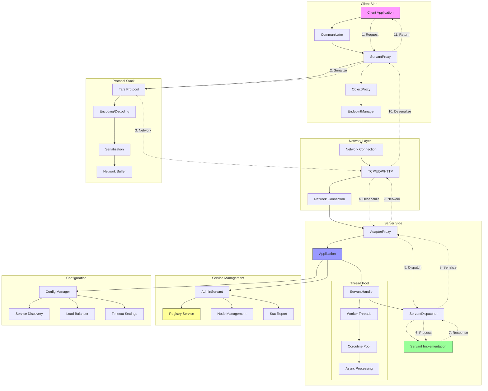
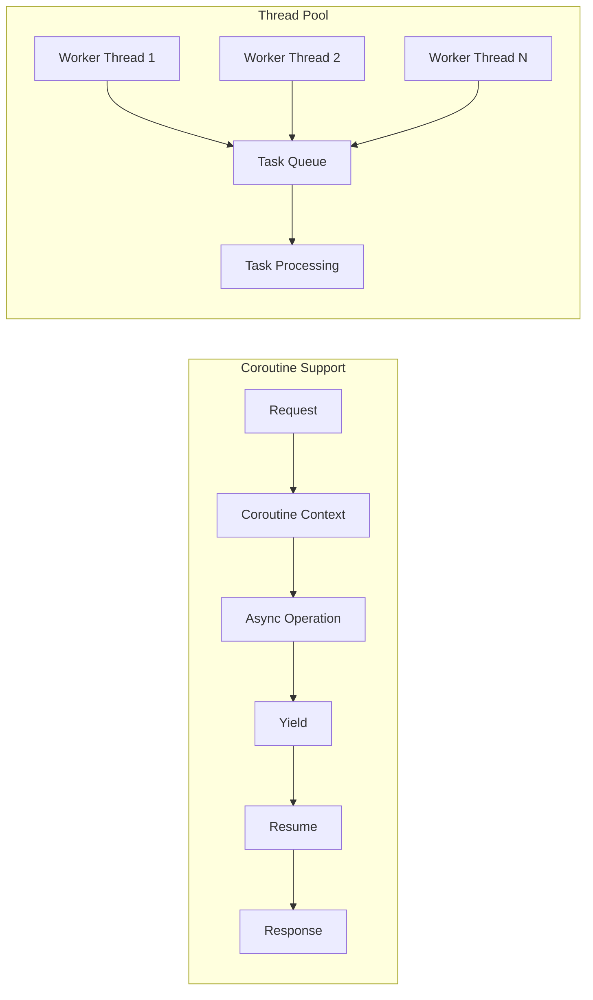
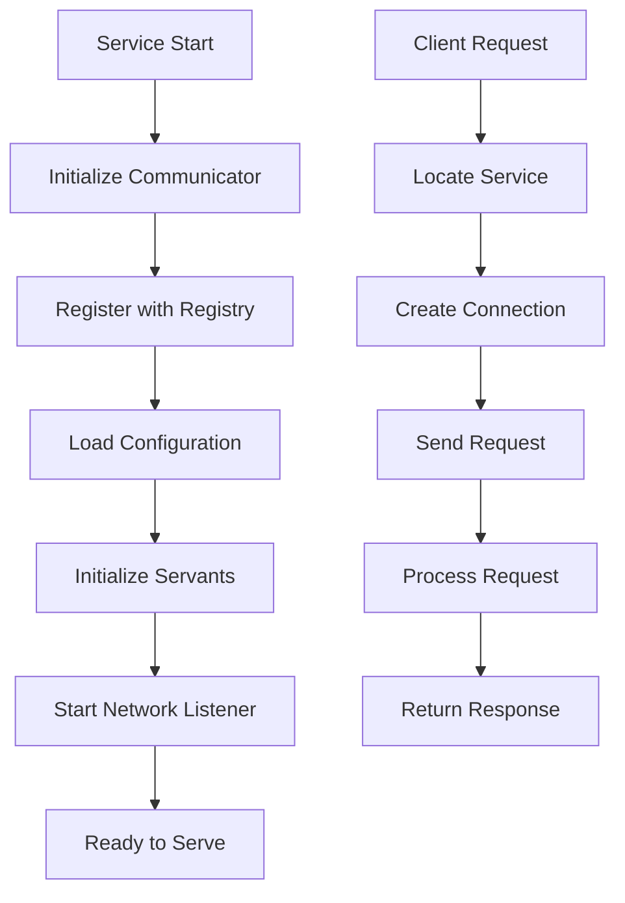
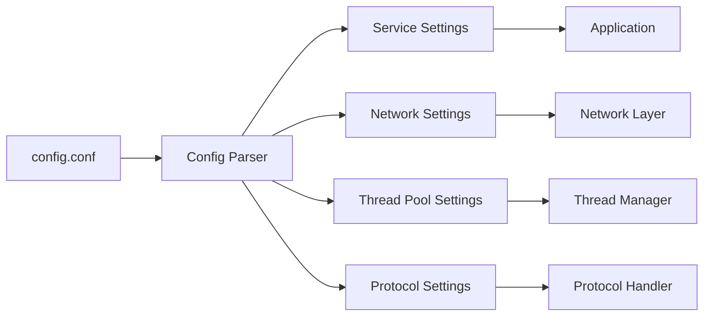

# TarsCpp Backend Processing Flow Diagram

## Overview Architecture



## Detailed Processing Components

### 1. Client-Side Components
- **Communicator**: Central client management
- **ServantProxy**: Client-side service proxy
- **ObjectProxy**: Connection management
- **EndpointManager**: Service discovery & load balancing

### 2. Server-Side Components
- **Application**: Main server framework
- **AdapterProxy**: Network endpoint handler
- **ServantHandle**: Request dispatcher
- **Servant**: Service implementation

### 3. Concurrency Model



### 4. Service Lifecycle



### 5. Configuration Management



## Key Processing Steps

1. **Service Registration**: Services register with registry service
2. **Client Discovery**: Clients discover services via registry
3. **Load Balancing**: Automatic load distribution
4. **Connection Pooling**: Efficient connection management
5. **Protocol Handling**: Auto serialization/deserialization
6. **Error Handling**: Built-in retry and failover
7. **Monitoring**: Real-time metrics and health checks

## Configuration Example

```ini
# Coroutine configuration
opencoroutine=1
corothreadmax=100
corothreadstack=128*1024

# Network settings
netthread=4
netthreadhandle=8

# Service discovery
registry=127.0.0.1:17890
locator=tars.tarsregistry.QueryObj@tcp -h 127.0.0.1 -p 17890
```

## Architecture Benefits

- **High Performance**: Built-in coroutine support
- **Scalability**: Horizontal scaling via service discovery
- **Reliability**: Built-in failover and retry mechanisms
- **Monitoring**: Real-time service health and metrics
- **Flexibility**: Multi-protocol support (TCP/UDP/HTTP)