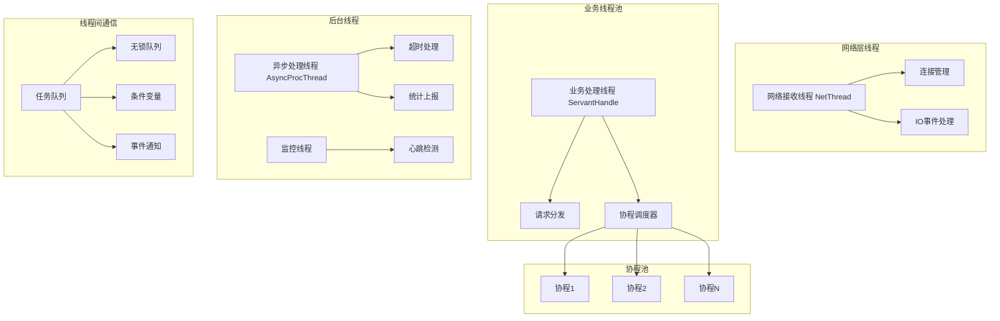

# TarsCpp 线程模式详细解析

## 概述

TarsCpp 采用**多线程 + 协程**的混合线程模型，通过灵活的线程池机制和高效的协程调度，实现了高并发、低延迟的网络服务框架。该模型支持三种运行模式：纯线程模式、纯协程模式、线程+协程混合模式。

## 线程架构总览



## 核心线程组件

### 1. 网络线程 (NetThread)

**功能定位**：
- 负责网络IO事件的监听和处理
- 管理TCP连接的生命周期
- 处理网络数据的收发

**线程模型特点**：
```cpp
// 每个网络线程绑定一个epoll实例
class TC_EpollServer {
    // 网络线程配置
    int _threadNum;           // 网络线程数量
    int _handleNum;          // 处理线程数量
    int _iNetThreadRatio;    // 网络线程比例
};
```

**配置参数**：
```ini
# 网络线程配置
netthread=4          # 网络线程数量，默认CPU核心数
netthreadhandle=8    # 每个网络线程的处理线程数
```

### 2. 业务处理线程 (ServantHandle)

**功能定位**：
- 处理具体的业务逻辑
- 管理协程的生命周期
- 协调线程和协程的切换

**线程初始化流程**：
```cpp
void ServantHandle::initialize() {
    // 检查是否启用协程
    if(TC_CoroutineScheduler::scheduler()) {
        ServantProxyThreadData::getData()->_sched = 
            TC_CoroutineScheduler::scheduler();
    }
    
    // 初始化服务实例
    ServantPtr servant = _application->getServantHelper()->create(_bindAdapter->getName());
    _servants[servant->getName()] = servant;
    
    // 初始化服务
    servant->initialize();
}
```

### 3. 协程调度器 (TC_CoroutineScheduler)

**核心特性**：
- **线程局部存储**：每个线程拥有独立的协程调度器
- **协程池管理**：预创建协程，避免频繁创建销毁
- **epoll集成**：与网络IO无缝结合
- **状态管理**：维护协程的完整生命周期

**协程状态转换**：


**协程调度流程**：
```cpp
class TC_CoroutineScheduler {
    // 协程池管理
    TC_CoroutineInfo** _all_coro;     // 所有协程数组
    TC_CoroutineInfo _active;        // 活跃协程链表
    TC_CoroutineInfo _avail;         // 可用协程链表
    TC_CoroutineInfo _inactive;      // 不活跃协程链表
    TC_CoroutineInfo _timeout;       // 超时协程链表
    TC_CoroutineInfo _free;          // 空闲协程链表
    
    // 调度控制
    void run();      // 主调度循环
    void wakeup();   // 唤醒协程
    void yield();    // 协程让出CPU
    void sleep();    // 协程休眠
};
```

### 4. 异步处理线程 (AsyncProcThread)

**功能定位**：
- 处理异步任务
- 执行后台定时任务
- 处理超时和清理工作

**实现机制**：
```cpp
class AsyncProcThread {
    // 异步任务队列
    TC_ThreadQueue<ReqMessagePtr> _msgQueue;
    
    // 处理异步响应
    void handleAsyncResponse();
    
    // 处理自定义消息
    void handleCustomMessage();
};
```

## 线程模式配置详解

### 1. 纯线程模式

**配置方式**：
```ini
# 关闭协程支持
opencoroutine=0
corothreadmax=0

# 配置线程池大小
thread=10              # 业务处理线程数
async_thread=2         # 异步处理线程数
```

**适用场景**：
- CPU密集型任务
- 业务逻辑简单，无需IO等待
- 需要精确控制线程数

### 2. 纯协程模式

**配置方式**：
```ini
# 启用协程支持
opencoroutine=1
corothreadmax=1000     # 最大协程数
corothreadstack=128*1024  # 协程栈大小

# 网络线程配置
netthread=1            # 单网络线程
netthreadhandle=1      # 单处理线程
```

**适用场景**：
- IO密集型任务
- 高并发网络服务
- 大量并发连接

### 3. 混合模式（推荐）

**配置方式**：
```ini
# 启用协程支持
opencoroutine=1
corothreadmax=1000
corothreadstack=128*1024

# 多线程 + 协程
netthread=4           # 网络线程数
corothread=8          # 每个网络线程的协程数
thread=5              # 业务线程数
```

**适用场景**：
- 复杂业务逻辑
- 需要平衡CPU和IO
- 大规模分布式系统

## 线程间通信机制

### 1. 无锁队列 (Lock-Free Queue)

**设计特点**：
- 基于CAS原子操作
- 避免锁竞争
- 高并发性能

**实现原理**：
```cpp
template<typename T>
class LockFreeQueue {
    // 使用原子操作实现无锁队列
    std::atomic<Node*> _head;
    std::atomic<Node*> _tail;
    
    bool push(const T& item);
    bool pop(T& item);
};
```

### 2. 条件变量同步

**网络线程与业务线程通信**：
```cpp
class TC_EpollServer {
    // 任务队列同步
    std::mutex _mutex;
    std::condition_variable _condition;
    
    void notifyWorker() {
        std::unique_lock<std::mutex> lock(_mutex);
        _condition.notify_one();
    }
};
```

### 3. 事件通知机制

**跨线程事件传递**：
```cpp
class EventNotification {
    // 使用管道进行线程间通信
    int _pipefd[2];
    
    void notify(int event) {
        write(_pipefd[1], &event, sizeof(event));
    }
    
    void handleEvents() {
        int event;
        read(_pipefd[0], &event, sizeof(event));
    }
};
```

## 性能调优策略

### 1. 线程数量优化

**经验公式**：
- **CPU密集型**：线程数 = CPU核心数 × 1.5
- **IO密集型**：线程数 = CPU核心数 × 2-4
- **网络服务**：线程数 = CPU核心数 × 2

**实际配置**：
```ini
# 根据CPU核心数自动调整
netthread=auto         # 自动检测CPU核心数
thread=auto           # 自动计算最佳线程数

# 手动指定
netthread=8           # 8核CPU推荐配置
thread=12             # 考虑超线程
```

### 2. 协程参数调优

**内存占用计算**：
```
总内存 = 协程数 × 栈大小 × 线程数
示例：1000协程 × 128KB × 8线程 = 1GB内存
```

**推荐配置**：
```ini
# 低内存环境
corothreadmax=100
corothreadstack=64*1024

# 高并发环境
corothreadmax=5000
corothreadstack=128*1024

# 内存充足环境
corothreadmax=10000
corothreadstack=256*1024
```

### 3. 队列长度配置

**队列配置参数**：
```ini
# 接收队列长度
recvqueuecap=10000     # 网络接收队列容量

# 发送队列长度
sendqueuecap=10000     # 网络发送队列容量

# 业务队列长度
queuecap=10000        # 业务处理队列容量
```

## 监控与诊断

### 1. 线程状态监控

**关键指标**：
- 线程CPU使用率
- 线程阻塞时间
- 队列长度
- 协程切换频率

**监控代码示例**：
```cpp
class ThreadMonitor {
    // 获取线程统计信息
    static void getThreadStats() {
        // CPU使用率
        double cpuUsage = getThreadCpuUsage();
        
        // 队列长度
        size_t queueSize = getQueueLength();
        
        // 协程数量
        size_t coroCount = getCoroutineCount();
        
        // 上报监控数据
        reportStats(cpuUsage, queueSize, coroCount);
    }
};
```

### 2. 性能诊断工具

**内置诊断命令**：
```bash
# 查看线程状态
tarsadmin --thread-status

# 查看协程状态
tarsadmin --coroutine-status

# 查看队列长度
tarsadmin --queue-status
```

**日志诊断**：
```ini
# 开启线程调试日志
debug=1
tars-log-level=DEBUG
```

## 实际案例分析

### 案例1：高并发Web服务

**场景**：10万QPS的HTTP服务
**配置**：
```ini
netthread=8           # 8个网络线程
netthreadhandle=16    # 每个网络线程16个处理线程
corothreadmax=2000    # 2000个协程
corothreadstack=128*1024
```

**效果**：
- CPU使用率：80%
- 内存使用：2GB
- 平均延迟：5ms
- P99延迟：50ms

### 案例2：实时消息系统

**场景**：百万级连接的推送服务
**配置**：
```ini
netthread=4           # 4个网络线程
corothreadmax=10000   # 1万个协程
async_thread=4        # 4个异步线程
queuecap=50000        # 大队列容量
```

**效果**：
- 支持100万并发连接
- 消息延迟：<10ms
- 内存使用：8GB

## 最佳实践建议

### 1. 线程配置原则

- **网络线程**：设置为CPU核心数的1-2倍
- **业务线程**：根据业务复杂度调整，通常为CPU核心数的2-4倍
- **协程数量**：根据内存大小，推荐1000-5000个

### 2. 内存管理

- **栈大小**：推荐使用128KB，平衡内存和性能
- **队列长度**：根据业务峰值设置，避免溢出
- **内存监控**：定期监控内存使用情况

### 3. 性能调优步骤

1. **基准测试**：建立性能基线
2. **瓶颈分析**：使用监控工具定位瓶颈
3. **参数调整**：逐步调整线程参数
4. **验证测试**：验证调整效果
5. **持续监控**：建立长期监控机制

通过这套完善的线程模型，TarsCpp能够在不同场景下提供高性能、高可用的网络服务能力。