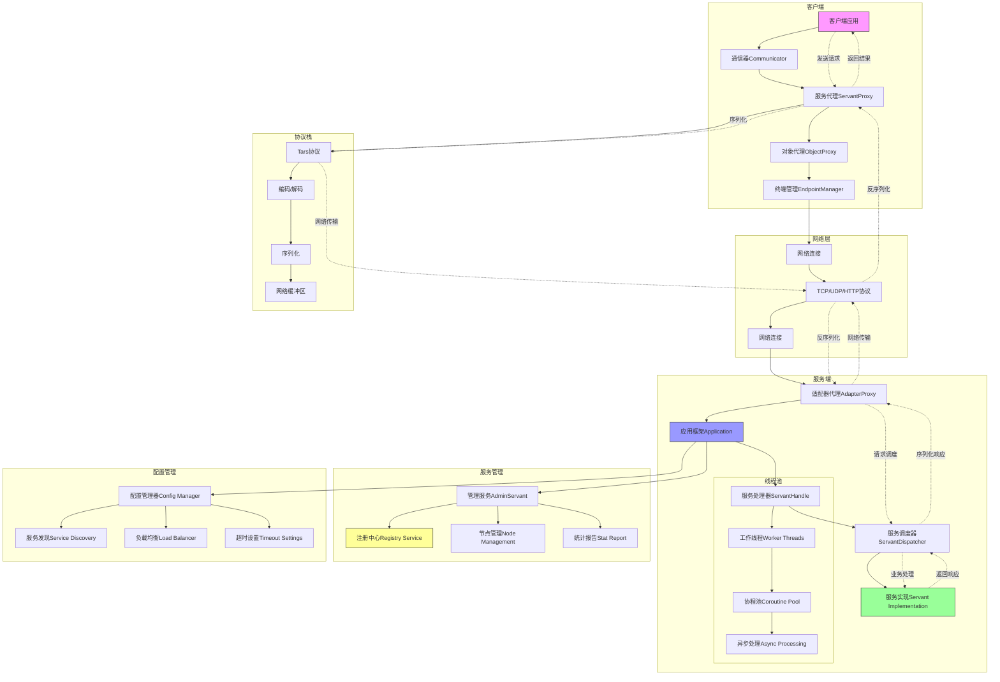
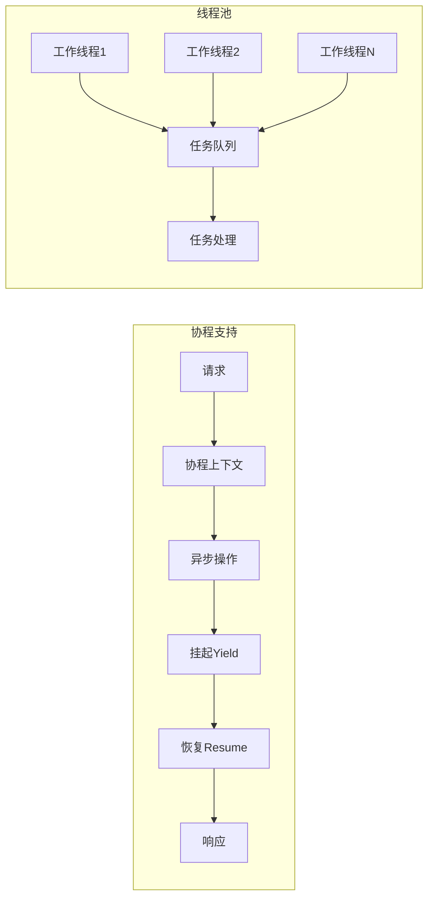
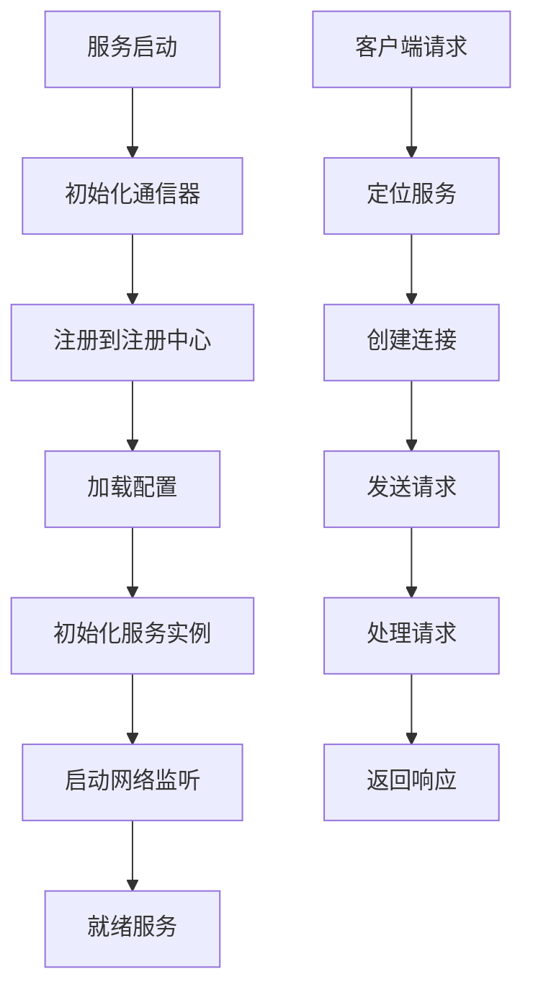
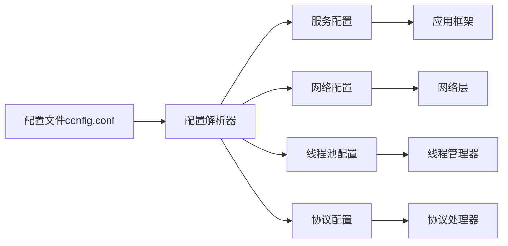

# TarsCpp 后台处理流程图（中文版本）

## 系统架构总览



## 详细组件说明

### 1. 客户端组件
- **通信器(Communicator)**: 客户端核心管理组件
- **服务代理(ServantProxy)**: 客户端服务调用代理
- **对象代理(ObjectProxy)**: 连接管理器
- **终端管理(EndpointManager)**: 服务发现和负载均衡

### 2. 服务端组件
- **应用框架(Application)**: 服务端主框架
- **适配器代理(AdapterProxy)**: 网络端点处理器
- **服务处理器(ServantHandle)**: 请求分发器
- **服务实现(Servant)**: 具体业务实现类

### 3. 并发模型



### 4. 服务生命周期



### 5. 配置管理



## 关键处理步骤

1. **服务注册**: 服务实例向注册中心注册
2. **客户端发现**: 客户端通过注册中心发现服务
3. **负载均衡**: 自动在多个服务实例间分配负载
4. **连接池**: 高效的连接管理
5. **协议处理**: 自动序列化/反序列化
6. **错误处理**: 内置重试和故障转移机制
7. **监控**: 实时服务指标和健康检查

## 配置示例

```ini
# 协程配置
opencoroutine=1                 # 开启协程支持
corothreadmax=100              # 最大协程数
corothreadstack=128*1024       # 协程栈大小

# 网络配置
netthread=4                    # 网络线程数
netthreadhandle=8              # 网络处理线程数

# 服务发现配置
registry=127.0.0.1:17890       # 注册中心地址
locator=tars.tarsregistry.QueryObj@tcp -h 127.0.0.1 -p 17890

# 超时配置
sync-invoke-timeout=3000       # 同步调用超时时间(ms)
asyn-invoke-timeout=5000       # 异步调用超时时间(ms)

# 线程池配置
thread=5                       # 业务处理线程数
maxconns=100000                # 最大连接数

# 协议配置
tars-protocol=1                # 使用Tars协议
```

## 架构优势

- **高性能**: 内置协程支持，减少上下文切换
- **可扩展性**: 通过服务发现实现水平扩展
- **可靠性**: 内置故障转移和重试机制
- **监控**: 实时服务健康检查和指标收集
- **灵活性**: 支持多种传输协议(TCP/UDP/HTTP)

## 实际应用场景

### 场景1: 电商订单处理
```
客户端(订单服务) → 用户服务 → 库存服务 → 支付服务 → 返回结果
```

### 场景2: 实时消息推送
```
客户端 → 推送服务 → 消息队列 → 用户设备 → 确认回执
```

### 场景3: 分布式计算
```
任务分发器 → 计算节点1 → 计算节点2 → 结果聚合器 → 返回结果
```

通过这套架构，TarsCpp能够提供企业级的微服务解决方案，支持大规模分布式系统的开发和运维。